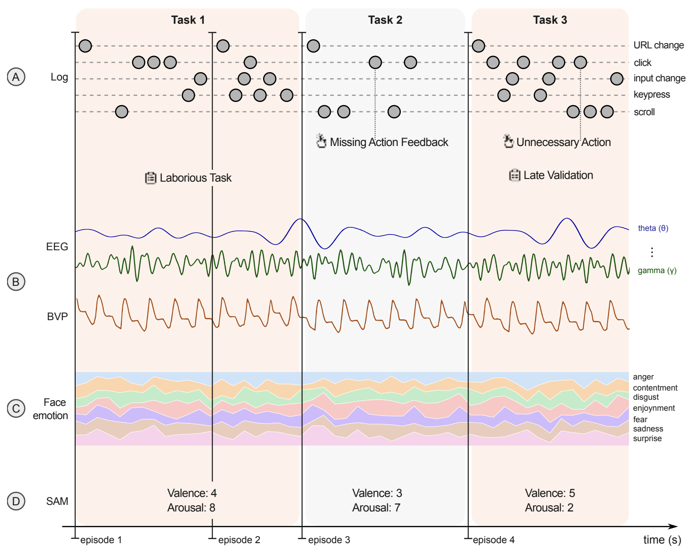

# AMUSED Dataset Documentation

The AMUSED dataset provides a comprehensive view of user interactions with a digital interface.

Each user interaction is called a **session**. In a session, the user interacts with the interface and performs a series of events (e.g., clicking buttons, filling out forms, changing pages, scrolling, etc.). There are **5 types of events**:
- **URL change (tabchange)**
- **click**
- **scroll**
- **input change (change)**
- **keypress**

We delimit a series of events by URL changes, giving rise to an **episode**. In other words, an episode starts whenever a URL change occurs.

> **Note:** Every episode contains only one URL change event (at the beginning), except for the last episode of the session, which may include several URL changes to conclude the interaction.

---

## Features

The dataset features are organized into several categories. Below, each category is described with a high-level overview followed by tables that define the specific columns (Name, Type, and Description).

### General Features

This section covers the session and episode structure, identifiers, timestamps, event types, and HTML-based features.

| Name             | Type   | Description |
|------------------|--------|-------------|
| **pid**        | int    | Episode identifier – corresponds to the number of tabchanges so far. |
| **eid**        | int    | Event identifier within the episode (resets with each new tabchange). |
| **rid**        | float  | Relative distance of the event within the episode (`eid / episode_length`). |
| **srid**       | float  | Relative distance of the event within the session (`eid / session_length`). |
| **rtid**       | float  | Relative distance of the task within the session (`task_id / max_tasks`). |
| **task_id**    | int    | Identifier for the task associated with the event. |
| **url**        | str    | URL of the page where the event occurred. |
| **unix_time**  | int    | System time in UNIX format. |
| **time**       | str    | Event timestamp (format: yyyy-mm-dd hh:mm:ss.ms). |
| **event**      | str    | Type of event; can be `tabchange`, `click`, `scroll`, `change`, or `keypress`. |
| **dom_object** | str    | DOM object associated with the event (e.g., `input`, `div`, `a`, etc.). |
| **xpath**      | str    | XPath of the DOM object (e.g., `html > body > div:nth-of-type(2) > div > div > a`). |
| **labels_0**   | str    | Usability smell labels from annotator 0. |
| **labels_1**   | str    | Usability smell labels from annotator 1. |
| **labels_2**   | str    | Usability smell labels from annotator 2. |
| **labels_union** | str  | Union of labels from annotators 0, 1, and 2. |
| **labels_inter** | str  | Intersection of labels from annotators 0, 1, and 2. |

---

### Duration Features

These features capture both event-level and episode-level durations, along with counts of various events. They enable the analysis of interaction intensity and timing.

#### Event-Level Duration

| Name                  | Type   | Description |
|-----------------------|--------|-------------|
| **event_duration**    | float  | Duration of the event, in seconds. |
| **event_cum_duration**| float  | Cumulative duration within the episode, in seconds. |

#### Episode-Level Duration

| Name                           | Type   | Description |
|--------------------------------|--------|-------------|
| **episode_tabchange_duration** | float  | Sum of durations for tabchange events in the episode. |
| **episode_change_duration**    | float  | Sum of durations for change events in the episode. |
| **episode_click_duration**     | float  | Sum of durations for click events in the episode. |
| **episode_scroll_duration**    | float  | Sum of durations for scroll events in the episode. |
| **episode_total_duration**     | float  | Sum of durations of all events in the episode. |

---

### Interaction Count Features

| Name                      | Type | Description |
|---------------------------|------|-------------|
| **episode_tabchange_num** | int  | Number of tabchange events in the episode. |
| **episode_change_num**    | int  | Number of change events in the episode. |
| **episode_click_num**     | int  | Number of click events in the episode. |
| **episode_scroll_num**    | int  | Number of scroll events in the episode. |
| **episode_keypress_num**  | int  | Number of keypress events (e.g., enter key) in the episode. |
| **episode_total_events**  | int  | Total number of events in the episode. |

---

### Event-Specific Columns

Event-specific features provide detailed information about each event type—whether it is a click, scroll, or change event—capturing nuances such as text, position, and input characteristics.

#### Click Events

| Name                     | Type  | Description |
|--------------------------|-------|-------------|
| **event_click_text**     | str   | Text of the object clicked by the user. |
| **event_click_text_length** | int | Number of characters in the clicked text. |
| **event_click_button**   | str   | Mouse button used (left, middle, or right). |
| **event_click_pos_x**    | float | X-position of the object on the screen. |
| **event_click_pos_y**    | float | Y-position of the object on the screen. |

#### Scroll Events

| Name                   | Type  | Description |
|------------------------|-------|-------------|
| **event_scroll_time**  | float | Total duration of consecutive scrolls, in seconds. |
| **event_scroll_num**   | int   | Total number of consecutive scroll events. |

#### Change Events

| Name                              | Type  | Description |
|-----------------------------------|-------|-------------|
| **event_change_value**            | str   | Hash of the original text entered by the user. |
| **event_change_value_length**     | int   | Length (in characters) of the original text entered. |
| **event_change_value_sim_episode**| float | Maximum Levenshtein similarity with other texts within the same episode. |
| **event_change_value_sim_session**| float | Maximum Levenshtein similarity with other texts within the same session. |
| **event_change_text**             | str   | Descriptive text for the input (e.g., from the `<label>`). |
| **event_change_text_length**      | int   | Length of the descriptive text. |
| **event_keypress_num**            | int   | Number of keypresses used to form the original text. |

---

### SAM Columns

| Name          | Type      | Description |
|---------------|-----------|-------------|
| **sam_valence** | float | Self-reported valence on a scale from 1 to 9. |
| **sam_arousal** | float | Self-reported arousal on a scale from 1 to 9. |

---

### Physiological Features (EEG/BVP)

These features are derived from Bitalino sensors and provide both episode-level and event-level information on physiological signals such as EEG and BVP. They include statistical summaries (minimum, maximum, mean, and standard deviation) for different wave components.

#### Episode-Level Bitalino Features

| Name                                | Type   | Description |
|-------------------------------------|--------|-------------|
| **episode_bit_eeg_{wave}_{metric}** | float  | EEG features calculated over a sequence of events constituting the episode. |
| **episode_bit_eeg_lim_a**           | int    | Time in ms of the first event in the EEG sequence. |
| **episode_bit_eeg_lim_b**           | int    | Time in ms of the last event in the EEG sequence. |
| **episode_bit_bvp_{wave}_{metric}** | float  | BVP features calculated over a sequence of events constituting the episode. |
| **episode_bit_bvp_lim_a**           | int    | Time in ms of the first event in the BVP sequence. |
| **episode_bit_bvp_lim_b**           | int    | Time in ms of the last event in the BVP sequence. |

#### Event-Level Bitalino Features

| Name                                | Type   | Description |
|-------------------------------------|--------|-------------|
| **event_bit_eeg_{wave}_{metric}**   | float  | EEG features calculated over a sequence of events preceding the current event. |
| **event_bit_eeg_lim_a**             | int    | Time in ms of the first event in the EEG sequence. |
| **event_bit_eeg_lim_b**             | int    | Time in ms of the last event in the EEG sequence. |

> **Note:** In the above, `{wave}` can be one of: `signal`, `features_ts`, `theta`, `alpha_low`, `alpha_high`, `beta`, or `gamma`.  
> `{metric}` can be one of: `min`, `max`, `avg`, or `std`.

---

### Face Emotions Columns

These features capture emotion-related data at both the episode and event levels, including emotion probabilities, entropy, and labels. The emotion categories include: anger, disgust, fear, enjoyment, contempt, sadness, and surprise.

#### Episode-Level Face Emotions

| Name                                 | Type  | Description |
|--------------------------------------|-------|-------------|
| **episode_face_most_likely_emotion** | int   | Index [1, 6] of the most likely emotion in the episode. |
| **episode_face_most_freq_emotion**   | int   | Index [1, 6] of the most frequent emotion in the episode. |
| **episode_face_{emotion}_proba**     | float | Average probability of the most likely emotion in the episode. |
| **episode_face_entropy**             | float | Average entropy of the emotion distribution in the episode. |
| **episode_face_lim_a**               | float | Time (in seconds) of the first event in the sequence. |
| **episode_face_lim_b**               | float | Time (in seconds) of the last event in the sequence. |

#### Event-Level Face Emotions

| Name                                    | Type  | Description |
|-----------------------------------------|-------|-------------|
| **event_face_avg_most_likely**          | int   | Index [1, 6] of the most likely emotion for that event. |
| **event_face_avg_most_freq**            | int   | Index [1, 6] of the most frequent emotion for that event. |
| **event_face_avg_{int}_{emotion}_proba** | float | Average probability of the most likely emotion for that event. |
| **event_face_avg_entropy**              | float | Average entropy of the emotion distribution for that event. |
| **event_face_lim_a**                    | float | Time (in seconds) of the first event in the sequence. |
| **event_face_lim_b**                    | float | Time (in seconds) of the last event in the sequence. |
|
> **Note:** In the above, `{int}` ranges from 0 to 6 and `{emotion}` can be one of: `anger`, `disgust`, `fear`, `enjoyment`, `contempt`, `sadness`, or `surprise`.

---

## Feature Engineering and Normalization

We applied the following preprocessing and feature engineering techniques:

- **Global Aggregation Features:**  
  Calculated for event durations and other numerical attributes (e.g., maximum, minimum, mean, first, last, and second values) within an episode.
- **Local Contextual Features:**  
  For each episode, features representing values of the previous and next *k* episodes (*k = 3*) were generated.
- **Handling Missing Features:**  
  When some features were not collected, they were filled with zeros. An exception is the SAM features, which were filled with a neutral score.
- **Normalization Techniques:**
  - **Z-Score Normalization:** Applied to event durations, scroll counts, physiological signals, face emotion probabilities, and similar features.
  - **Min-Max Normalization:** Applied to spatial features (e.g., click positions) and SAM features (valence and arousal).

As a result, our final dataset consists of **20,050 samples** with **148 features**.

